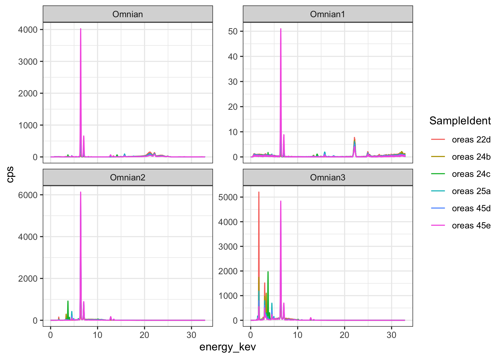
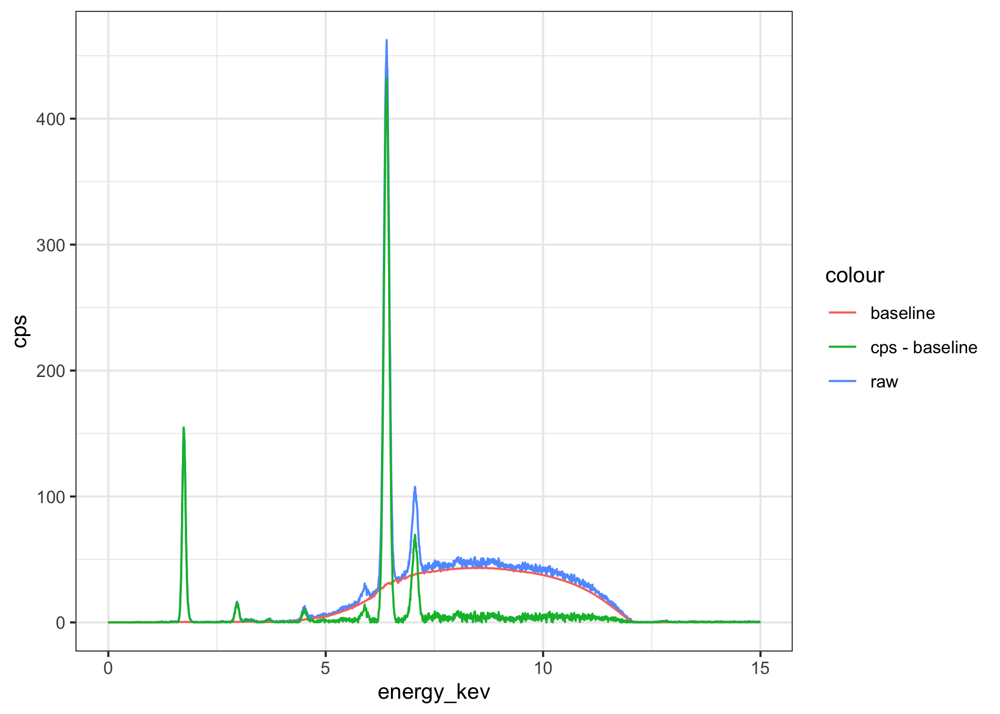
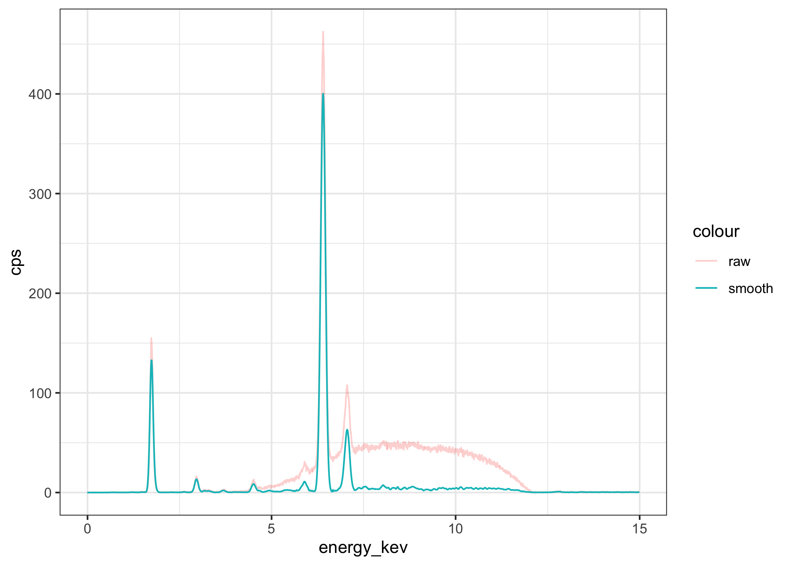

<!-- README.md is generated from README.Rmd. Please edit that file -->

# xrftools


[](https://codecov.io/github/paleolimbot/xrftools?branch=master)

The goal of xrftools is to provide tools to read, plot, and interpret
X-Ray fluorescence spectra.

## Installation

You can install xrftools from github with:

``` r
# install.packages("remotes")
remotes::install_github("leedrake5/xrftools")
```

Note if you want the origional version of this package, you will want to navigate to [paleolimbot's page](https://www.github.com/paleolimbot/xrftools)

## Example

Read in a Panalytical XRF spectrum and plot it.

``` r
library(tidyverse)
library(xrftools)
#> 
#> Attaching package: 'xrftools'
#> The following object is masked from 'package:stats':
#> 
#>     filter

pan_example_dir <- system.file("spectra_files/Panalytical", package = "xrftools")
pan_files <- list.files(pan_example_dir, ".mp2", full.names = TRUE)
specs <- read_xrf_panalytical(pan_files)
specs %>%
  xrf_despectra() %>%
  unnest(.spectra) %>%
  ggplot(aes(x = energy_kev, y = cps, col = SampleIdent)) +
  geom_line() +
  facet_wrap(vars(ConditionSet), scales = "free_y")
```

<!-- -->

## Reading other formats

`read_xrf_panalytical()` reads Panalytical `.mp2` files, but any spectrum that arrives as counts-per-channel plus an energy calibration (the usual SEM-EDS / generic-MCA case) can be ingested with `xrf_spectra_from_counts()`. It builds the `energy_kev` axis from a linear (or quadratic) calibration via `xrf_calibrate_energy()` and keeps the raw `counts` and live time so that Poisson-weighted deconvolution can use them.

``` r
# counts-per-channel + a keV calibration (gain is keV/channel)
spec <- xrf_spectra_from_counts(
  counts, gain = 0.02, zero = 0, livetime = 60,
  SampleIdent = "std-1"
)

# or just the channel -> energy conversion (mind keV vs eV per channel)
energy_kev <- xrf_calibrate_energy(0:2047, gain = 0.02, zero = 0)
```

## Baselines

The **xrf** package can use several existing methods for estimating “background” or “baseline” values. The most useful of these for XRF spectra is the Sensitive Nonlinear Iterative Peak (SNIP) method ([Ryan et al. 1988](https://doi.org/10.1016/0168-583X%2888%2990063-8)), implemented in the **Peaks** package. A modern alternative, `xrf_add_baseline_arpls()`, uses asymmetrically reweighted penalized least squares ([Baek et al. 2015](https://doi.org/10.1039/C4AN01061B)) — a single-parameter Whittaker smoother that follows a smooth scatter / Compton continuum more gently than SNIP and needs no channel-window width.

``` r
specs %>%
  slice(3) %>%
  xrf_add_baseline_snip(iterations = 20) %>%
  xrf_despectra() %>%
  unnest() %>%
  filter(energy_kev <= 15) %>%
  ggplot(aes(x = energy_kev)) +
  geom_line(aes(y = cps, col = "raw")) +
  geom_line(aes(y = baseline, col = "baseline")) +
  geom_line(aes(y = cps - baseline, col = "cps - baseline"))
#> Warning: `cols` is now required when using unnest().
#> Please use `cols = c(.spectra)`
```

<!-- -->

## Smoothing

``` r
specs %>%
  slice(3) %>%
  xrf_add_baseline_snip(iterations = 20) %>%
  xrf_add_smooth_filter(filter = xrf_filter_gaussian(alpha = 2.5), .iter = 5) %>%
  xrf_despectra() %>%
  unnest() %>%
  filter(energy_kev <= 15) %>%
  ggplot(aes(x = energy_kev)) +
  geom_line(aes(y = cps, col = "raw"), alpha = 0.3) +
  geom_line(aes(y = smooth - baseline, col = "smooth"))
#> Warning: `cols` is now required when using unnest().
#> Please use `cols = c(.spectra)`
```

<!-- -->

## Deconvolution

`xrf_add_deconvolution_gls()` fits a non-negative linear combination of per-element Gaussian templates to the (baseline-subtracted) spectrum. Since the original unconstrained fit it has gained:

- **Non-negativity** (`nonneg = TRUE`, the default): coefficients are solved with NNLS (the **nnls** package; [Lawson & Hanson 1995](https://doi.org/10.1137/1.9781611971217)) so peak areas and concentrations can no longer come back negative. Set `nonneg = FALSE` for the classic unconstrained least squares.
- **Counting-statistics weighting** (`weighting`): `"poisson"` runs an iteratively-reweighted fit with `1/variance` weights derived from the modelled counts (needs raw `.counts` and `.livetime`); `"auto"` (default) uses Poisson weighting when counts and live time are available and unweighted least squares otherwise.
- **Diagnostics**: the `.deconvolution_fit` table now reports a `condition_number` (κ of the design matrix — large values flag collinear/ill-conditioned line overlaps) and a proper count-space Pearson `chi_sq` (finite on real spectra, unlike the old NaN/Inf value).
- **Calibration refinement** (`refine_calibration = TRUE`): refines a two-parameter (zero + gain) energy calibration of the template centroids by variable projection before the final fit, so small gain/zero drift does not bias amplitudes.
- **Template caching** (`cache_templates = TRUE`, default): reuses the design matrix across successive spectra that share an energy grid / peaks / line-shape (e.g. a batch from one instrument).
- **Corrected peak intensities**: relative line intensities no longer double-count the fluorescence yield (the tabulated [EADL](https://www.osti.gov/biblio/10121422) emission probabilities already include ω), so cross-shell (K:L:M) ratios are now physical.

The new physics below is opt-in through flat scalar arguments plus `xrf_tube()` / `xrf_geometry()`:

``` r
deconvoluted <- specs %>%
  filter(ConditionSet %in% c("Omnian", "Omnian2")) %>%
  xrf_add_baseline_snip(iterations = 20) %>%
  xrf_add_deconvolution_gls(
    .spectra$energy_kev, .spectra$cps,
    peaks = xrf_energies("major", beam_energy_kev = kV),
    .counts = .spectra$counts, .livetime = LiveTime, # enables Poisson weighting
    detector_type = "SDD",             # energy-dependent resolution sigma(E)
    efficiency = TRUE, escape = TRUE,  # detector efficiency + escape peaks
    tube = xrf_tube("Rh", kv = 40),    # adds Rayleigh/Compton scatter templates
    weighting = "poisson", nonneg = TRUE
  )
```

The worked example below keeps the original arguments for comparability:

``` r
deconvoluted <- specs %>%
  filter(ConditionSet %in% c("Omnian", "Omnian2")) %>%
  xrf_add_smooth_filter(filter = xrf_filter_gaussian(width = 5), .iter = 20) %>%
  xrf_add_baseline_snip(.values = .spectra$smooth, iterations = 20) %>%
  xrf_add_deconvolution_gls(
    .spectra$energy_kev, 
    .spectra$smooth - .spectra$baseline, 
    energy_max_kev = kV * 0.75, peaks = xrf_energies("major")
  )

certified_vals <- system.file("spectra_files/oreas_concentrations.csv", package = "xrftools") %>%
  read_csv(col_types = cols(standard = col_character(), value = col_double(), .default = col_guess())) %>%
  filter(method == "4-Acid Digestion") %>%
  select(SampleIdent = standard, element, certified_value = value)

deconv <- deconvoluted %>% 
  unnest(.deconvolution_peaks) %>%
  select(SampleIdent, ConditionSet, kV, element, height, peak_area, peak_area_se)

deconv %>%
  left_join(certified_vals, by = c("SampleIdent", "element")) %>%
  ggplot(aes(x = certified_value, y = peak_area, col = SampleIdent, shape = ConditionSet)) +
  geom_errorbar(aes(ymin = peak_area - peak_area_se, ymax = peak_area + peak_area_se)) +
  geom_point() +
  facet_wrap(~element, scales = "free") +
  theme_bw(10)
#> Warning: Removed 22 rows containing missing values (geom_point).
```

<!-- -->

``` r
deconv_element <- deconvoluted %>%
  unnest(.deconvolution_components)

ggplot() +
  geom_line(
    aes(x = energy_kev, y = response), 
    data = deconvoluted %>% unnest(.deconvolution_response), 
    size = 0.2
  ) +
  geom_area(
    aes(x = energy_kev, y = response_fit, fill = element), 
    data = deconvoluted %>% unnest(.deconvolution_components), 
    alpha = 0.5
  ) +
  facet_wrap(~ConditionSet + SampleIdent, scales = "free") +
  scale_y_sqrt() +
  theme_bw(10)
#> Warning in self$trans$transform(x): NaNs produced
#> Warning: Transformation introduced infinite values in continuous y-axis
#> Warning: Removed 4504 rows containing missing values (position_stack).
```

<!-- -->

## Detector response

The detector is now modelled explicitly rather than as a single
fixed-width Gaussian.

- **Energy-dependent resolution.** Peak width follows the Fano/noise model `FWHM(E) = sqrt(N^2 + (2.3548)^2 * F * ε * E)` ([Fano 1947](https://doi.org/10.1103/PhysRev.72.26)). Select a material with `detector_type` (or override `fano` / `epsilon_ev` / `noise_fwhm_ev`); `xrf_detector_presets()` ships SDD, SiLi, SiPIN, HPGe and CdTe defaults. `xrf_detector_sigma_kev()` / `xrf_detector_fwhm_ev()` expose the model directly.
- **Efficiency** (`efficiency = TRUE`): reweights each line by `xrf_detector_efficiency()` — window transmission × dead-layer transmission × active-volume absorption — which cuts light elements at a Be window and heavy-element K-lines in a thin Si crystal. Override geometry with `be_window_um` / `dead_layer_um`.
- **Escape peaks** (`escape = TRUE`): adds `xrf_escape_peaks()` satellites ([Reed & Ware 1972](https://doi.org/10.1088/0022-3735/5/6/029)) tied to each parent line's amplitude (small for Si, up to ~10–15% just above the Ge K edge, large for CdTe).
- **Line shape** (`tail` / `step` / `beta`): a Hypermet low-energy tail and flat shelf ([Phillips & Marlow 1976](https://doi.org/10.1016/0029-554X%2876%2990472-9)) from incomplete charge collection via `xrf_lineshape()`; the defaults `(0, 0, NULL)` give a pure Gaussian, and the reported `peak_area` includes the tail area when `tail > 0`.
- **Sum / pile-up peaks**: `sum_peaks = TRUE` adds coincidence templates at `E_i + E_j`; supplying a detector pulse-pair time `pileup_tau` (with counts + live time) instead applies a physically-constrained two-pass correction with coincidence areas fixed to `2τ/T * A_i A_j`.

``` r
xrf_detector_presets()

# resolution grows and efficiency falls with energy
xrf_detector_sigma_kev(c(0.28, 5.9, 59.3, 98.4), "SDD")
xrf_detector_efficiency(c(0.5, 6, 30, 60, 100), "SDD")
```

## Excitation & line data

- **Cross-section excitation weighting** (`excitation_weighting = "cross_section"`, default): subshell vacancy production is weighted by the energy-dependent partial photoionization cross section σ_shell(E0) from the rebuilt [EPDL97](https://www.osti.gov/biblio/295438) `x_ray_cross_sections` table (all subshells K–M5, native grid ~5 eV to 200 keV), so the K:L:M branching correctly tracks the beam energy. `"jump"` restores the classic beam-independent absorption-jump behaviour.
- **Coster-Kronig L-cascade** (`coster_kronig = TRUE`, default): redistributes L1/L2 vacancies down the L subshells before radiative decay ([Krause 1979](https://doi.org/10.1063/1.555594)), fixing the L-family shape of Pb/Au/W/U.
- **More lines.** `xrf_energies()` now includes heavy-element **M-lines** (Z 50–92) and light-element **K-lines** (C/N/O/F), so heavy elements below their L edge and the ubiquitous O K-line are representable.
- **Electron-impact excitation (SEM-EDS).** Pass `excitation = "electron"` to `xrf_energies()` (with an `overvoltage_min` cut) to weight production by the electron-impact ionization cross section instead of the photoionization one. The default method is **Bote-Salvat (2008)** ([Bote & Salvat 2008](https://doi.org/10.1103/PhysRevA.77.042701); absolute cross sections vendored in `x_ray_bote_salvat`); [Gryzinski (1965)](https://doi.org/10.1103/PhysRev.138.A336) and [Bethe (1930)](https://doi.org/10.1002/andp.19303970303) are also selectable via `xrf_electron_ionization_cross_section()`.
- **Tube scatter.** Supplying a `tube = xrf_tube(...)` adds Rayleigh (coherent) and Compton (incoherent, energy-shifted and Doppler-broadened; [Compton 1923](https://doi.org/10.1103/PhysRev.21.483), [Klein & Nishina 1929](https://doi.org/10.1007/BF01366453)) scatter templates via `xrf_scatter_peaks()`. The tube's own emission spectrum ([Ebel](https://doi.org/10.1002/%28SICI%291097-4539%28199907/08%2928:4%3C255::AID-XRS347%3E3.0.CO;2-Y) continuum + anode lines) is available as `xrf_tube_spectrum()` and can drive polychromatic excitation in the quantification layer.

``` r
# heavy-element M-lines and light-element K-lines are now present
xrf_energies("everything", beam_energy_kev = 30)

# SEM-EDS: electron excitation with an overvoltage cut
xrf_energies("major", beam_energy_kev = 20,
             excitation = "electron", overvoltage_min = 1.5)

# Rayleigh + Compton scatter templates for a Rh tube, and the tube spectrum
xrf_scatter_peaks(xrf_tube("Rh", kv = 40), xrf_geometry(scatter_angle_deg = 135),
                  detector_type = "SDD")
xrf_tube_spectrum(xrf_tube("Rh", kv = 40), seq(1, 40, 0.05))
```

## Quantification

Two complementary paths turn fitted peak areas into composition.

**(1) `xrf_quantify()` — fundamental parameters, closed to 100%.** 
Converts areas to mass fractions using `xrf_fp_sensitivity()` (the fundamental-parameters formalism, [Sherman 1955](https://doi.org/10.1016/0371-1951%2855%2980041-0)) with a first-order matrix correction: iterative self-absorption (`self_absorption = TRUE`), optional secondary and tertiary enhancement fluorescence (`secondary_fluorescence` / `tertiary_fluorescence`, [Shiraiwa & Fujino 1966](https://doi.org/10.1143/JJAP.5.886)), optional polychromatic excitation when a `tube` is supplied, and optional oxide stoichiometry (`oxide`, default `FALSE` — XRF cannot measure oxygen, so oxygen-by-difference is a modelling choice). Concentrations are renormalized to sum to `total`. The self-absorption closed form is exact only for monochromatic excitation and assumes a thick, homogeneous sample.

**(2) `xrf_observed_mass()` — un-normalized, matrix-decoupled.** 
For oxides / minerals where closing to 100% is unsafe (a wrong oxide guess or a missing light element smears across a normalized assay), this reports each element independently and never forces a closed sum. It returns `observed_mass = A_i / S_i`, the observed **areal mass** = concentration × that element's information depth — **not** a matrix-free value and **not** comparable across elements or across samples of differing matrix. To make values comparable, use `self_absorption = "generalized"` (divides out the per-element depth with a documented generic `matrix`) and/or `normalization = "compton"`, and even then only as well as the generic matrix approximates the real one. It is a **primary-fluorescence** quantity — secondary enhancement is not modelled, so elements just below a strong exciter (e.g. Cr/V/Ti/Ca under Fe Kα) read high — and it assumes a thick, homogeneous sample.

Plus `xrf_compton_normalize()` (divide areas by the fitted Compton area — the standard matrix-robust normalizer for portable XRF) and `xrf_calibrate()` (fit empirical per-element response factors by regressing certified reference values against observed mass; pass the result back as `calibration =`).

``` r
fit <- xrf_deconvolute_gaussian_least_squares(
  spec$energy_kev, spec$cps,
  peaks = xrf_energies("major", beam_energy_kev = 40),
  detector_type = "SDD", tube = xrf_tube("Rh", kv = 40)
)

# (1) fundamental-parameters concentrations, renormalized to 100%
xrf_quantify(fit, beam_energy_kev = 40, detector_type = "SDD",
             self_absorption = TRUE, secondary_fluorescence = TRUE,
             tube = xrf_tube("Rh", kv = 40))

# (2) un-normalized, matrix-decoupled per-element areal mass
xrf_observed_mass(fit, beam_energy_kev = 40, detector_type = "SDD",
                  self_absorption = "generalized", matrix = "silicate")

# matrix-robust Compton normalization, and an empirical calibration
xrf_compton_normalize(fit)
k <- xrf_calibrate(standards, values, beam_energy_kev = 40, detector_type = "SDD")
```

``` r
spec <- specs %>%
  slice(7) %>%
  xrf_add_baseline_snip(iterations = 20) %>%
  xrf_add_smooth_filter(filter = xrf_filter_gaussian(alpha = 2.5), .iter = 5) %>%
  pull(.spectra) %>%
  first()

sigma_index <- 6
energy_kev <- spec$energy_kev
values <- spec$fit - spec$background
energy_res <- mean(diff(energy_kev))

search <- Peaks::SpectrumSearch(values, threshold = 0.01, sigma = sigma_index)

g <- function(x, mu = 0, sigma = 1, height = 1) height * exp(-0.5 * ((x - mu) / sigma) ^ 2)

tbl <- tibble::tibble(
  peak_index = search$pos,
  peak_energy_kev = energy_kev[peak_index], 
  peak_sigma = sigma_index * energy_res,
  peak_height = values[peak_index],
  peak_area = peak_height * peak_sigma * sqrt(2 * pi)
)

peak_response = pmap(list(mu = tbl$peak_energy_kev, sigma = tbl$peak_sigma, height = tbl$peak_height), g, energy_kev)
spec$deconv <- do.call(cbind, peak_response) %>%
  rowSums()
spec$deconv2 <- search$y

ggplot(spec, aes(energy_kev)) +
  geom_line(aes(y = fit - background, col = "original")) +
  geom_line(aes(y = deconv, col = "deconv")) +
  xlim(0, 10) +
  stat_xrf_peaks(aes(y = fit - background), epsilon = 10)
```

``` r
oreas22d <- specs %>%
  filter(SampleIdent == "oreas 22d") %>%
  unnest(.spectra) %>%
  mutate(cps = counts / LiveTime)

xrf_en <- x_ray_xrf_energies %>%
  crossing(tibble(ConditionSet = unique(oreas22d$ConditionSet))) %>%
  group_by(ConditionSet) %>%
  mutate(
    data = list(oreas22d[oreas22d$ConditionSet == ConditionSet[1],]),
    counts = approx(data[[1]]$energy_kev, data[[1]]$counts, energy_kev)$y,
    fit = approx(data[[1]]$energy_kev, data[[1]]$fit, energy_kev)$y,
    background = approx(data[[1]]$energy_kev, data[[1]]$background, energy_kev)$y,
    cps = approx(data[[1]]$energy_kev, data[[1]]$cps, energy_kev)$y
  ) %>%
  select(-data)

library(plotly)
plot_ly() %>%
  add_lines(x = ~energy_kev, y = ~cps, color = ~ConditionSet, hoverinfo = "none", 
            data = oreas22d) %>%
  add_markers(x = ~energy_kev, y = ~cps, text = ~element, color = ~ConditionSet, data = xrf_en)
```

## References

The physical models used above draw on the following literature (links resolve to the DOI or the report record).

**Baseline & fitting**

- Ryan, C.G., Clayton, E., Griffin, W.L., Sie, S.H., Cousens, D.R. (1988). SNIP, a statistics-sensitive background treatment for the quantitative analysis of PIXE spectra in geoscience applications. *Nuclear Instruments and Methods in Physics Research B* **34**(3), 396–402. [doi:10.1016/0168-583X(88)90063-8](https://doi.org/10.1016/0168-583X%2888%2990063-8)
- Lawson, C.L. & Hanson, R.J. (1995). *Solving Least Squares Problems* (SIAM Classics in Applied Mathematics; orig. 1974) — the non-negative least squares (NNLS) algorithm. [doi:10.1137/1.9781611971217](https://doi.org/10.1137/1.9781611971217)
- Baek, S.-J., Park, A., Ahn, Y.-J., Choo, J. (2015). Baseline correction using asymmetrically reweighted penalized least squares smoothing (arPLS) — used by `xrf_add_baseline_arpls()`. *Analyst* **140**(1), 250–257. [doi:10.1039/C4AN01061B](https://doi.org/10.1039/C4AN01061B)

**Atomic & line data**

- Cullen, D.E., Hubbell, J.H., Kissel, L. (1997). *EPDL97: The Evaluated Photon Data Library, '97 Version.* UCRL-50400 Vol. 6, Rev. 5, Lawrence Livermore National Laboratory — photoionization / scattering cross sections. [OSTI 295438](https://www.osti.gov/biblio/295438)
- Perkins, S.T., Cullen, D.E., Chen, M.H., Rathkopf, J., Scofield, J., Hubbell, J.H. (1991). *Tables and Graphs of Atomic Subshell and Relaxation Data Derived from the LLNL Evaluated Atomic Data Library (EADL), Z = 1–100.* UCRL-50400 Vol. 30 — fluorescence yields, emission probabilities, Coster-Kronig data. [OSTI 10121422](https://www.osti.gov/biblio/10121422)
- Krause, M.O. (1979). Atomic radiative and radiationless yields for K and L shells. *Journal of Physical and Chemical Reference Data* **8**(2), 307–327. [doi:10.1063/1.555594](https://doi.org/10.1063/1.555594)

**Detector response**

- Fano, U. (1947). Ionization yield of radiations. II. The fluctuations of the number of ions. *Physical Review* **72**(1), 26–29 — the Fano factor in the resolution model. [doi:10.1103/PhysRev.72.26](https://doi.org/10.1103/PhysRev.72.26)
- Reed, S.J.B. & Ware, N.G. (1972). Escape peaks and internal fluorescence in X-ray spectra recorded with lithium-drifted silicon detectors. *Journal of Physics E: Scientific Instruments* **5**(6), 582–584. [doi:10.1088/0022-3735/5/6/029](https://doi.org/10.1088/0022-3735/5/6/029)
- Phillips, G.W. & Marlow, K.W. (1976). Automatic analysis of gamma-ray spectra from germanium detectors — the Hypermet peak shape (Gaussian + low-energy tail + step). *Nuclear Instruments and Methods* **137**(3), 525–536. [doi:10.1016/0029-554X(76)90472-9](https://doi.org/10.1016/0029-554X%2876%2990472-9)

**Excitation**

- Bote, D. & Salvat, F. (2008). Calculations of inner-shell ionization by electron impact with the distorted-wave and plane-wave Born approximations. *Physical Review A* **77**, 042701. [doi:10.1103/PhysRevA.77.042701](https://doi.org/10.1103/PhysRevA.77.042701)
- Gryzinski, M. (1965). Classical theory of atomic collisions. I. Theory of inelastic collisions. *Physical Review* **138**, A336–A358. [doi:10.1103/PhysRev.138.A336](https://doi.org/10.1103/PhysRev.138.A336)
- Bethe, H. (1930). Zur Theorie des Durchgangs schneller Korpuskularstrahlen durch Materie. *Annalen der Physik* **397**(3), 325–400. [doi:10.1002/andp.19303970303](https://doi.org/10.1002/andp.19303970303)
- Ebel, H. (1999). X-ray tube spectra. *X-Ray Spectrometry* **28**(4), 255–266 — the bremsstrahlung continuum + anode-line tube model. [doi:10.1002/(SICI)1097-4539(199907/08)28:4&lt;255::AID-XRS347&gt;3.0.CO;2-Y](https://doi.org/10.1002/%28SICI%291097-4539%28199907/08%2928:4%3C255::AID-XRS347%3E3.0.CO;2-Y)

**Scattering**

- Compton, A.H. (1923). A quantum theory of the scattering of X-rays by light elements. *Physical Review* **21**(5), 483–502 — the incoherent (Compton) energy shift. [doi:10.1103/PhysRev.21.483](https://doi.org/10.1103/PhysRev.21.483)
- Klein, O. & Nishina, Y. (1929). Über die Streuung von Strahlung durch freie Elektronen nach der neuen relativistischen Quantendynamik von Dirac. *Zeitschrift für Physik* **52**, 853–868 — the Klein-Nishina differential cross section. [doi:10.1007/BF01366453](https://doi.org/10.1007/BF01366453)

**Fundamental-parameters quantification**

- Sherman, J. (1955). The theoretical derivation of fluorescent X-ray intensities from mixtures. *Spectrochimica Acta* **7**, 283–306 — the fundamental-parameters equation. [doi:10.1016/0371-1951(55)80041-0](https://doi.org/10.1016/0371-1951%2855%2980041-0)
- Shiraiwa, T. & Fujino, N. (1966). Theoretical calculation of fluorescent X-ray intensities in fluorescent X-ray spectrochemical analysis. *Japanese Journal of Applied Physics* **5**(10), 886–899 — secondary and tertiary enhancement fluorescence. [doi:10.1143/JJAP.5.886](https://doi.org/10.1143/JJAP.5.886)

**Modern methods & atomic data (roadmap)**

These inform ongoing modernization (see `MODERNIZATION_PLAN.md`); the current release still derives its atomic data from EPDL97/EADL97 (above), and its deconvolution from the Gaussian-template least squares described here.

- Elam, W.T., Ravel, B.D., Sieber, J.R. (2002). A new atomic database for X-ray spectroscopic calculations. *Radiation Physics and Chemistry* **63**(2), 121–128 — a consolidated modern replacement for the EPDL/EADL tables. [doi:10.1016/S0969-806X(01)00227-4](https://doi.org/10.1016/S0969-806X%2801%2900227-4)
- Chantler, C.T. (2000). Detailed tabulation of atomic form factors, photoelectric absorption and scattering cross section (FFAST). *Journal of Physical and Chemical Reference Data* **29**(4), 597–1056 — relativistic near-edge cross sections. [doi:10.1063/1.1321055](https://doi.org/10.1063/1.1321055)
- Schoonjans, T., Brunetti, A., Golosio, B., Sanchez del Rio, M., Solé, V.A., Ferrero, C., Vincze, L. (2011). The xraylib library for X-ray–matter interactions. Recent developments. *Spectrochimica Acta Part B* **66**(11–12), 776–784 — the maintained X-ray physics library behind most modern XRF codes. [doi:10.1016/j.sab.2011.09.011](https://doi.org/10.1016/j.sab.2011.09.011)
- Solé, V.A., Papillon, E., Cotte, M., Walter, P., Susini, J. (2007). A multiplatform code for the analysis of energy-dispersive X-ray fluorescence spectra (PyMCA). *Spectrochimica Acta Part B* **62**(1), 63–68 — the reference open-source EDXRF fitting/FP implementation. [doi:10.1016/j.sab.2006.12.002](https://doi.org/10.1016/j.sab.2006.12.002)
